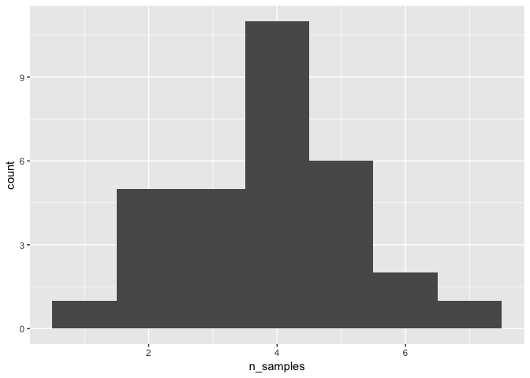

# Variance component analysis


In this tutoral, we are going to used linear mixed models implemented in the lme4 R package to estimate the proportion of variance in the dataset that can be attributed to different experimental and biological factors. More concretely, we want to estimate what has large effect on CD14 cell surface expression in human iPSC-derived macrophages - the date when the measurement was made or the cell line from which the cells originated. 

First, we need to load some packages that are used in the analysis.

```r
library("lme4")
library("dplyr")
library("tidyr")
library("ggplot2")
```

We also need to define a function that calculates the percentage of variance explained my each term in the linear mixed model. We will use it later:

```r
#' Calculate the proportion of variance explaned by different factors in a lme4 model
varianceExplained <- function(lmer_model){
  variance = as.data.frame(lme4::VarCorr(lmer_model))
  var_percent = dplyr::mutate(variance, percent_variance = vcov/sum(vcov)) %>% 
    dplyr::select(grp, percent_variance) %>% 
    dplyr::mutate(type = "gene")
  var_row = tidyr::spread(var_percent, grp, percent_variance)
  return(var_row)  
}
```

## Preparing the data

First, we need to import the processed data

```r
flow_processed = readRDS("../../results/processed_flow_cytometry_data.rds")
line_medatada = readRDS("../../data/compiled_line_metadata.rds")
```

Next, we can map the flow cytometry channels to the three specfic proteins that were measured in the experiment (CD14, CD16 and CD206)

```r
#Map flow cytometry channels to specifc proteins
channel_marker_map = data_frame(channel = c("APC.A","PE.A","Pacific.Blue.A"), 
                                protein_name = c("CD206","CD16","CD14"))
```

Finally, we can calculate the relative flourecent intensity values for all three proteins in each sample:

```r
#Calculate intensity values
unique_lines = dplyr::select(line_medatada, line_id, donor, genotype_id) %>% unique()
flow_data = dplyr::left_join(flow_processed, channel_marker_map, by = "channel") %>%
  dplyr::mutate(donor = ifelse(donor == "fpdj", "nibo",donor)) %>% #fpdj and nibo are the same donors
  dplyr::left_join(unique_lines, by = "donor") %>%
  dplyr::mutate(intensity = mean2-mean1) %>%
  dplyr::select(line_id, genotype_id, donor, flow_date, protein_name, purity, intensity)

#Construct a matrix of intensity values
intensity_matrix = dplyr::select(flow_data, line_id, genotype_id, flow_date, protein_name, intensity) %>% 
  tidyr::spread(protein_name, intensity) %>%
  dplyr::mutate(sample_id = paste(line_id, as.character(flow_date), sep = "_"))
```

```
## Warning in format.POSIXlt(as.POSIXlt(x), ...): unknown timezone 'zone/tz/
## 2018c.1.0/zoneinfo/Europe/Tallinn'
```

## Detecting outliers
We use principal component analysis to identify potential outlier samples:

```r
#Make a matrix of flow data and perform PCA
flow_matrix = as.matrix(intensity_matrix[,c(4,5,6)])
rownames(flow_matrix) = intensity_matrix$sample_id
pca_res = prcomp(flow_matrix, scale = TRUE, center = TRUE)

#Make a PCA plot
pca_df = dplyr::mutate(as.data.frame(pca_res$x), sample_id = rownames(pca_res$x))
ggplot(pca_df, aes(x = PC1, y = PC2, label = sample_id)) + geom_point() + geom_text()
```

<!-- -->

After closer inspection, it seems that there are two potential outlier samples. Let's remove those. Note that his step is somewhat subjective and you should make sure that you are not unintentionally skewing your results. One option is to rerun your analysis without removing outliers and checking how the results change.

```r
#Choose outliers based on PCA and remove them
outlier_samples = c("fafq_1_2015-10-16","iill_1_2015-10-20")
flow_df_filtered = dplyr::filter(intensity_matrix, !(sample_id %in% outlier_samples))
```

## Visualising sources of variation
First, let's plot the CD14 flourecent intensity according to the date when the meaurement was performed.

```r
ggplot(flow_df_filtered, aes(x = as.factor(flow_date), y = CD14)) + 
  geom_point() + 
  theme(axis.text.x = element_text(angle = 45, hjust = 1)) +
  ylab("CD14 flourecent intensity") +
  xlab("Measurement date")
```

<!-- -->

Now, let's group the samples accoring to the cell line that the come from and redo the plot. To make the plot easier to read, we should first keep only the cell lines that had more than one sample.

```r
replicated_donors = dplyr::group_by(flow_df_filtered, line_id) %>% 
  dplyr::summarise(n_replicates = length(line_id)) %>% 
  dplyr::filter(n_replicates > 1)
flow_df_replicated = dplyr::filter(flow_df_filtered, line_id %in% replicated_donors$line_id)
```

We can now make the same plot, but group the intensities according to the line_id:

```r
ggplot(flow_df_replicated, aes(x = line_id, y = CD14)) + 
  geom_point() + 
  theme(axis.text.x = element_text(angle = 45, hjust = 1)) +
  ylab("CD14 flourecent intensity") +
  xlab("Name of the cell line")
```

<!-- -->

Based on these plots, which one do you think explains more variation in the data - the date of the experiment or the cell line which sample originated from?

## Variance component analysis
Finally, let's use the linear mixed model to estimate proportion of variance explained by the date of the experiment (flow_date) an the the cell line from which the sample originated (line_id). 

```r
cd14_variance = lmer(CD14 ~ (1|flow_date) + (1|line_id), flow_df_filtered) %>% varianceExplained()
```

For sanity check, we can repeat the same analysis on the the subset of the data in which each line had at least two replicate samples (but some dates now had only a single measurement):

```r
cd14_variance_replicated = lmer(CD14 ~ (1|flow_date) + (1|line_id), flow_df_replicated) %>% varianceExplained()
```


